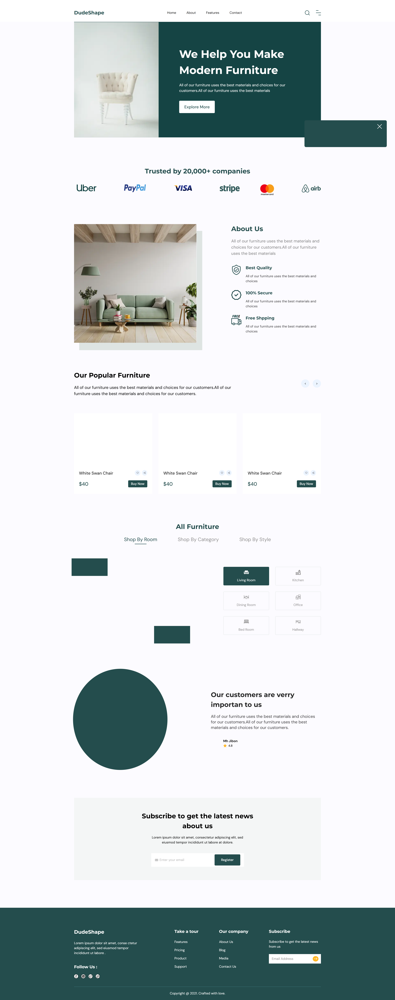
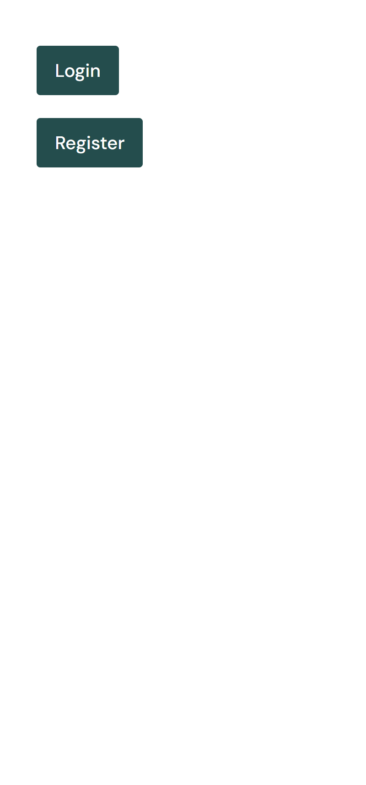
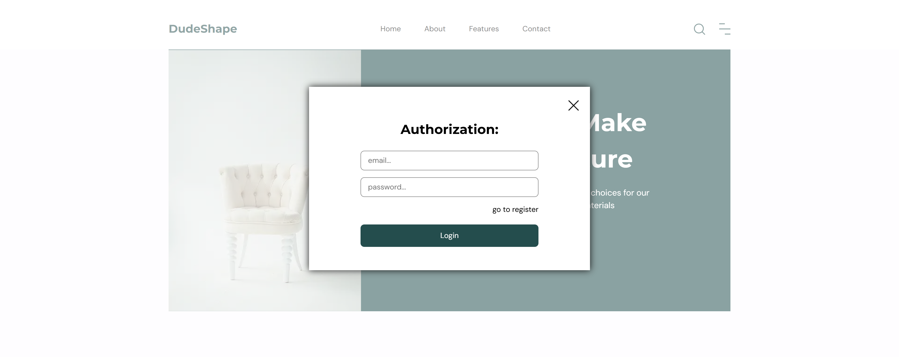
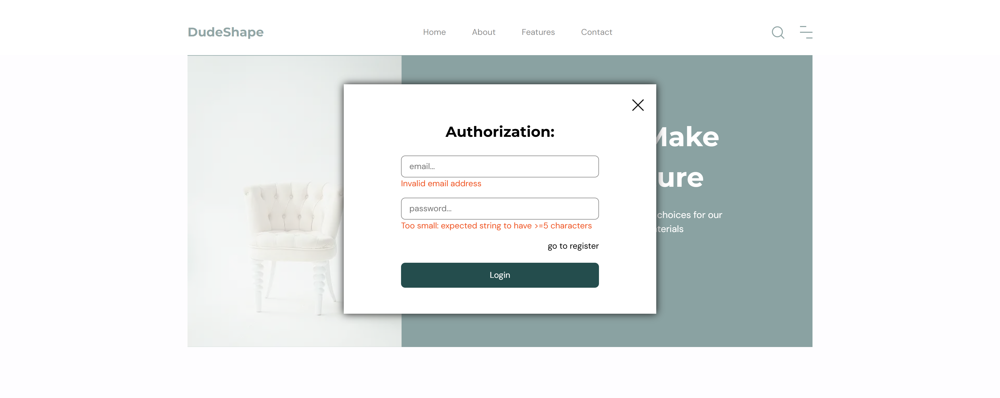
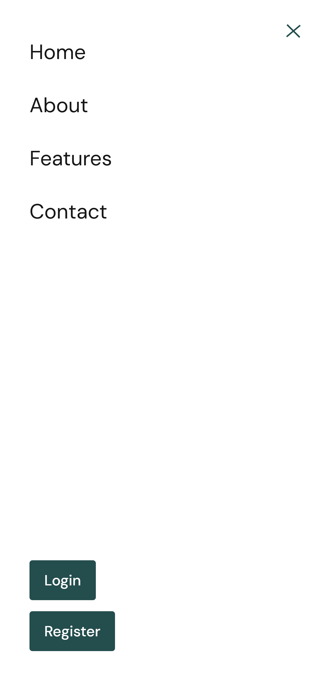
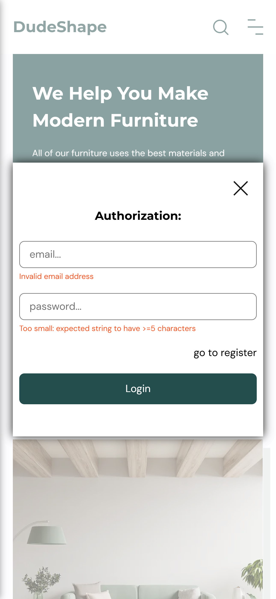
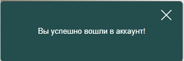

# DudeShape

## 📜 Лицензия
Этот проект распространяется под лицензией **MIT**.  
Подробнее см. [LICENSE](LICENSE).

**Описание проекта**: House — это сайт мебельного магазина с модальными окнами, регистрацией(авторизацией) и fsd архитектурой, он написан на NextJS(TypeScript), NestJS и Scss.
[](https://opensource.org/licenses/MIT)
[](https://nextjs.org/)
[](https://nestjs.com)

### Функционал

- Адаптивный дизайн
- На мобильных устройствах бургер меню
- Анимации при наведении, фокусировании и нажатии
- Регистрация
- Авторизация
- JWT
- Модальные окна
- Валидация данных
- Автоматическая прокрутка
- Бизнес логика

### Технологии
- **Frontend**: React 18, TypeScript, Zustand, React Router 6, React Query, Axios, Vite, SCSS, SVGR.
  [](https://nextjs.org/) 
  [](https://www.typescriptlang.org/)  
  [](https://github.com/pmndrs/zustand) 
  [](https://tanstack.com/query/latest/)  
  [](https://github.com/colinhacks/zod)
  [](https://react-hook-form.com/)
  [](https://axios-http.com/)   
  [](https://sass-lang.com/)  
  [](https://react-svgr.com/)  
  [](https://feature-sliced.design/)
- **Backend**: Express, MySQL, TypeORM.
   [](https://nestjs.com/)  
  [](https://www.postgresql.org/)  
  [](https://typeorm.io/)   
- **Дизайн**: Figma.
  [](https://figma.com/)

### Установка

1. Клонирование репозитория:

   ```bash
   git clone https://github.com/BlackDarkes/DudeShape.git

   ```

2. Запустите проект:
   
    Node.js >= 18.x
    npm >= 9.x
   ```bash
   cd api && npm install && npm start
   cd frontend && npm install && npm run dev
   ```

### Пример кода

1. React

```TypeScript
"use client";

import { useStore } from "@/app/store/store";
import { FlashButton } from "../FlashButton/FlashButton";
import { useTimeClose } from "@/features/flashMessage";
import styles from './FlashMessage.module.scss'

export const FlashMessage = () => {
  const { message, flashIsOpen } = useStore();

  useTimeClose();

  return (
    <section className={`${styles.flash} ${flashIsOpen ? styles.flashShow : ""}`}>
      <FlashButton />

      <p className={styles.flashText}>{message}</p>
    </section>
  );
};

```

### Структура проекта:
    project/  
    ├── frontend/       
    ├── api/        
    └── README.md  

## Изображения проекта:
1. **Desktop изображения:**
  
  *Рис. 1: Главная страница сайта в десктопной версии.* 

  
  *Рис. 2: Бургер меню в десктопной версии.* 

  
  *Рис. 3: Форма авторизации.*

  
  *Рис. 4: Форма авторизации с валидацией.*

1. **Mobile изображения:**
   
   

   *Рис. 5: Главная страница сайта в мобильной версии.*

   

   *Рис. 6: Бургер меню в мобильной версии.*

   

   *Рис. 7: Бургер меню в авторизованном режиме в мобильной версии.*

   

   *Рис. 8: Форма авторизации с валидацией в мобильной версии.*

   

   *Рис. 9: Flash сообщение от успешной авторизацией в мобильной версии.*

   

   *Рис. 10: Бургер меню при авторизации в мобильной версии.*